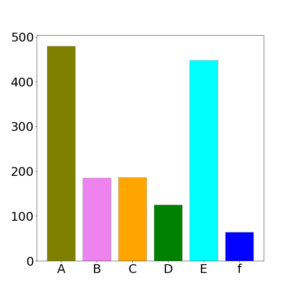
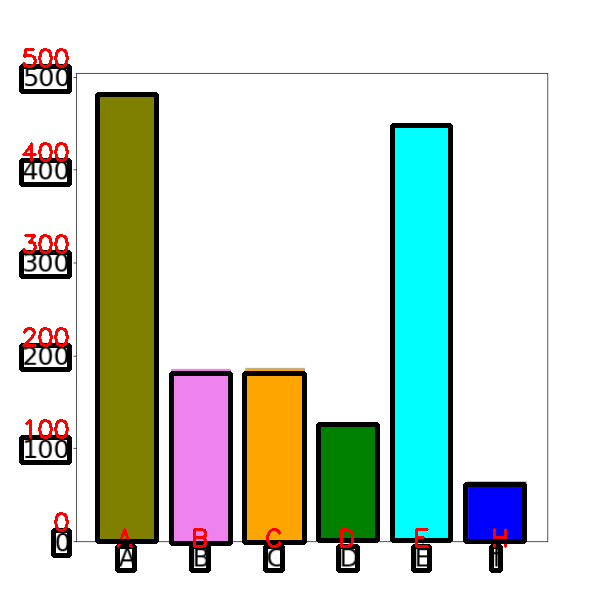

# bar_char_det_rec

## 简介

此工程是做条形图检测和坐标识别的，即给一张条形统计图，检测出图中所有的条形图以及坐标，并且识别出X，Y轴的坐标。其中条形图和坐标位置是共享一个检测网络实现，坐标识别单独一个网络。工程目录如下

```
bar_char_det_rec
│   ├── bar_chart_detect
│   │   ├── ckpt
│   │   ├── data
│   │   ├── examples
│   │   ├── models
│   │   ├── prepare_data
│   │   └── tools
│   ├── detRecRes
│   └── number_recognize
│       ├── ckpt
│       ├── data
│       ├── examples
│       ├── models
│       ├── prepare_data
│       └── tools
```

## 检测网络

### 数据集

检测数据集使用`matplotlib`库做出来的，原理是随机生成不同颜色不同大小的条形图，具体实现见`tools/char_gen.py`。

### 网络

检测网络使用`end-to-end one-stage`网络，比较轻量级。具体实现见`models/network.py`，网络的anchor通过`kmeans`聚类生成，具体实现见`tools/kmeans.py`。

## 识别网络

### 数据集

识别网络的数据集也是通过`matplotlib`库，随机生成字符串做出来的。

### 网络

识别网络使用共享卷积层，接多个`fc+softmax`，类似于有序字符串多标签分类。

## 运行

### 依赖库

tensorflow==1.12.0
opencv==3.4.1
以及其他python包

### 运行脚本

所有依赖库安装之后，运行根目录下的`test.py`，即可将检测结果保存下来。

## 效果图




## 其他

整个工程中，数据预处理，训练和推理的代码都很完整，后面再更新README...O(∩_∩)O
